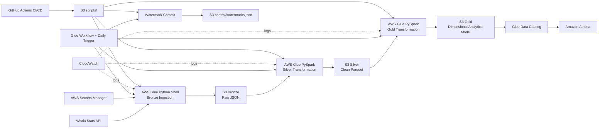
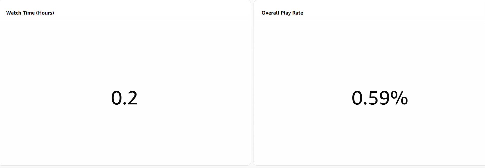
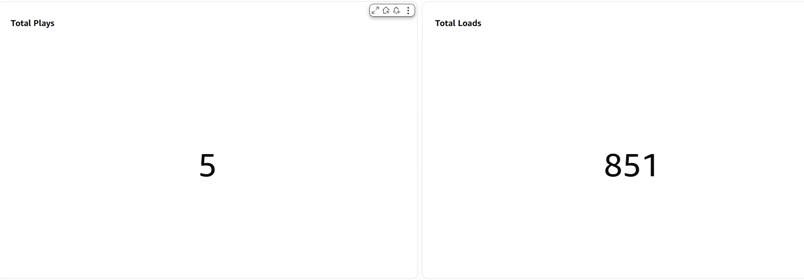
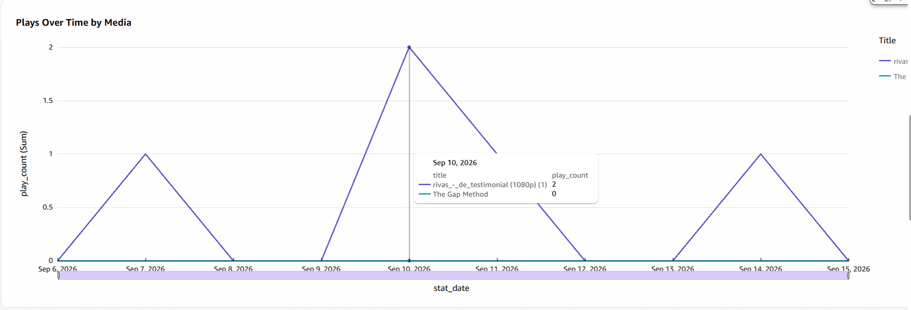
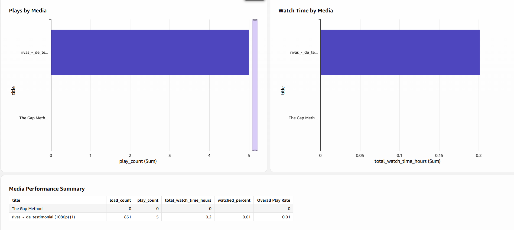

# Wistia Video Analytics — End-to-End Data Engineering Project

AWS-based data engineering pipeline for Wistia media-level and visitor-level analytics.

## Architecture



## What the pipeline does

1. Authenticates to the Wistia API using a token stored in AWS Secrets Manager.
2. Ingests media metadata, aggregate stats, daily stats, engagement data, paginated events, and visitor data.
3. Writes immutable raw API responses to the Bronze layer in S3.
4. Uses PySpark to normalize, type, flatten, deduplicate, and validate data into Silver Parquet datasets.
5. Builds analytics-ready Gold tables with stable grains and data-quality checks.
6. Registers Gold data in Glue Data Catalog and queries it with Athena.
7. Orchestrates the daily chain with AWS Glue Workflow.
8. Advances the incremental watermark only after downstream processing succeeds.
9. Uses GitHub Actions for CI and OIDC-based CD to AWS without long-lived AWS access keys.

## Gold model

| Table | Grain | Purpose |
|---|---|---|
| `dim_media` | one row per media | media descriptive attributes |
| `dim_visitor` | one row per visitor | visitor profile plus latest observed geography |
| `dim_date` | one row per calendar date | reusable date dimension |
| `fact_media_engagement` | one row per media/date | daily loads, plays, play rate, watch time, events, unique visitors, watched percent |
| `fact_engagement_event` | one row per event | visitor-level engagement detail |

## Repository layout

```text
.github/workflows/       GitHub Actions CI/CD
config/                  media IDs and data contracts
docs/                    architecture, model, runbook, evidence, decisions
infrastructure/          AWS setup notes and IAM templates
jobs/                    Glue production jobs
scripts/                 API exploration and pagination verification
sql/                     Athena validation queries
src/                     reusable ingestion client code
tests/                   unit tests
```

## Production jobs

- `jobs/bronze_ingestion.py` — AWS Glue Python Shell
- `jobs/silver_transformation.py` — AWS Glue Spark / PySpark
- `jobs/gold_transformation.py` — AWS Glue Spark / PySpark
- `jobs/commit_watermark.py` — AWS Glue Python Shell

Production workflow:

```text
Scheduled Trigger
  -> wistia-bronze-ingestion
  -> after-bronze-success
  -> wistia-silver-transformation
  -> after-silver-success
  -> wistia-gold-transformation
  -> after-gold-success
  -> wistia-commit-watermark
```

## Incremental strategy

- Media metadata is re-read daily because the project contains only two configured media IDs.
- Event ingestion uses date windows, full pagination, overlap, and deduplication by `event_key`.
- Daily statistics are deduplicated by `(media_id, stat_date)`.
- Visitor records are deduplicated by `visitor_key`.
- The Bronze job writes a candidate watermark.
- `control/watermarks.json` is committed only after the Gold stage succeeds, preventing a failed downstream run from skipping data.

See `docs/INCREMENTAL_STRATEGY.md` for details.


## Dashboard Preview

The project includes an Amazon Quick dashboard built on top of the Athena Gold-layer data model.

### Key Performance Indicators





### Plays Over Time



### Media Performance




## CI/CD

### CI

`.github/workflows/ci.yml` runs on pushes to `main` and pull requests:

```text
ruff check .
pytest -q
```

### CD

`.github/workflows/deploy.yml` uses GitHub OIDC to assume a least-privilege AWS IAM role and uploads only the production Glue scripts to:

```text
s3://<project-bucket>/scripts/
```

No long-lived AWS access keys are stored in GitHub.

Repository variables required by CD:

- `AWS_REGION`
- `AWS_ROLE_TO_ASSUME`
- `S3_BUCKET`

## Security

- Never commit the Wistia API token.
- Local development uses an ignored `.env` file.
- AWS runtime authentication uses Secrets Manager.
- S3 public access remains blocked.
- GitHub deployment uses OIDC and a least-privilege role scoped to `scripts/*`.
- Visitor-level datasets can contain PII such as IP/email; access to Bronze/Silver/Gold should remain restricted.

## Validation

Athena validation SQL is in:

`sql/athena_validation_queries.sql`

The validated checks include:

- Gold tables are queryable.
- media/date fact grain is unique.
- event keys are unique.
- media foreign keys resolve to `dim_media`.
- analytical media/day queries return results.
- visitor/geography analytics return results.

## Seven-day production requirement

The automated workflow has passed an end-to-end validation run. The remaining time-based requirement is to retain evidence for seven consecutive scheduled production days.

Use:

`docs/SEVEN_DAY_PRODUCTION_EVIDENCE.md`

Do not mark the seven-day requirement complete until all seven scheduled runs are documented.

## Documentation index

- `docs/ARCHITECTURE.md`
- `docs/API_EXPLORATION.md`
- `docs/DATA_MODEL.md`
- `docs/INCREMENTAL_STRATEGY.md`
- `docs/ASSUMPTIONS_TRADEOFFS.md`
- `docs/REQUIREMENTS_TRACEABILITY.md`
- `docs/OPERATIONS_RUNBOOK.md`
- `docs/SEVEN_DAY_PRODUCTION_EVIDENCE.md`
- `docs/WALKTHROUGH_GUIDE.md`
- `infrastructure/PHASE3_AWS_SETUP.md`
- `infrastructure/PHASE4_SILVER_SETUP.md`
- `infrastructure/PHASE5_GOLD_SETUP.md`
- `infrastructure/PHASE6_CATALOG_ATHENA.md`
- `infrastructure/PHASE7_AUTOMATION_CICD.md`

## Current status

- API exploration and schema discovery — complete
- Bronze ingestion — complete
- Silver transformation — complete
- Gold dimensional model — complete
- Glue Catalog + Athena validation — complete
- Glue Workflow orchestration — complete
- Incremental watermark commit — complete
- GitHub CI — complete
- GitHub OIDC CD — complete
- End-to-end workflow validation — complete
- Seven consecutive scheduled production days — **in progress / evidence pending**
